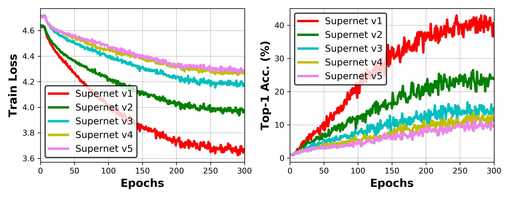
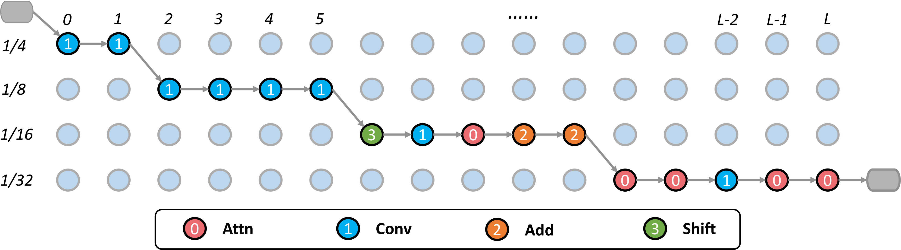
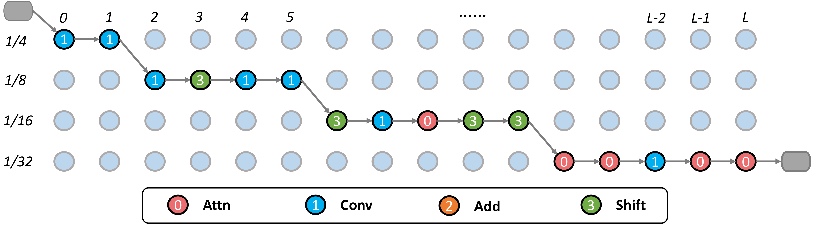

# ShiftAddNAS on CV Tasks

### Training trajectories of all Supernet variants



### Visualizing the searched architectures

> Visualization of the searched architecture ShiftAddNAS-T1↑1 with 83% top-1 test accuracy on ImageNet



> Visualization of the searched architecture ShiftAddNAS-T1↑2 with 82.8% top-1 test accuracy on ImageNet



### Retraining the searched architecture

> Prerequisite

Build Adder operators (GCC==7.5.0; CUDA==10.2; Pytorch==1.4)

````
cd retraining_hytra_distill/boss_candidates/adder/
python setup.py install
````

> Test the pretrained model

<details>

<summary>
ShiftAddNAS_T0_mix_v3
</summary>

Model can be downloaded from [here](https://drive.google.com/file/d/1eux9RY0qzKt_rLQRHPWi7iNEzLV6NtXT/view?usp=sharing)

````
python -m torch.distributed.launch --nproc_per_node=8 --use_env test.py \
--model bossnet_T0_mix_v3_distilled \
--input-size 256 \
--batch-size 128 \
--data-path path_to_imagenet \
--num_workers 8 \
--resume ShiftAddNAS_T0_mix_v3.pth
````

You should expect:

````
* Acc@1 81.554 Acc@5 95.642 loss 0.725
````

</details>

<details>

<summary>
ShiftAddNAS_T0_mix_v4
</summary>

Model can be downloaded from [here](https://drive.google.com/file/d/1fr8i3OTDxptg30AKQBfAFTUZf1vlJgvj/view?usp=sharing)

````
python -m torch.distributed.launch --nproc_per_node=8 --use_env test.py \
--model bossnet_T0_mix_v4_distilled_Q \
--input-size 256 \
--batch-size 128 \
--data-path path_to_imagenet \
--num_workers 8 \
--resume ShiftAddNAS_T0_mix_v4.pth

````

You should expect:

````
* Acc@1 82.584 Acc@5 96.156 loss 0.685
````

</details>

<details>

<summary>
ShiftAddNAS_T1_mix_v3
</summary>

Model can be downloaded from [here](https://drive.google.com/file/d/1J5h-WX0Ctg_5VYJ9MUHUpsFeKIRDn7bK/view?usp=sharing)

````
python -m torch.distributed.launch --nproc_per_node=8 --use_env test.py \
--model bossnet_T1_mix_v3_distilled_Q \
--input-size 256 \
--batch-size 128 \
--data-path path_to_imagenet \
--num_workers 8 \
--resume ShiftAddNAS_T1_mix_v3.pth
````

You should expect:

````
* Acc@1 82.780 Acc@5 96.228 loss 0.678
````

</details>

<details>

<summary>
ShiftAddNAS_T1_mix_v4
</summary>

Model can be downloaded from [here](https://drive.google.com/file/d/1Yx0840fd1cINKHs9r0IR7gO4cuq9-8a3/view?usp=sharing)

````
python -m torch.distributed.launch --nproc_per_node=8 --use_env test.py \
--model bossnet_T1_mix_v4_distilled_Q \
--input-size 256 \
--batch-size 128 \
--data-path path_to_imagenet \
--num_workers 8 \
--resume ShiftAddNAS_T1_mix_v4.pth
````

You should expect:

````
* Acc@1 82.974 Acc@5 96.364 loss 0.667
````

</details>

> If you want to measure the corresponding FLOPs or energy, refer to commands below:

````
python cal_flops.py \
--model bossnet_T0_mix_v4_distilled_Q \
--input-size 256

python cal_energy.py \
--model bossnet_T0_mix_v4_distilled_Q \
--input-size 256
````

> If you want to train it yourself from scratch, refer to commands below:

````
python -m torch.distributed.launch --nproc_per_node=8 --use_env main.py \
--model bossnet_T0_mix_v4_distilled_Q \
--input-size 224 \
--batch-size 128 \
--data-path path_to_imagenet \
--num_workers 8 \
--distillation-type hard \
--teacher-model regnety_160 \
--teacher-path regnety_160.pth

python -m torch.distributed.launch --nproc_per_node=8 --use_env main.py \
--model bossnet_T1_mix_v4_distilled_Q \
--input-size 224 \
--batch-size 112 \
--data-path path_to_imagenet \
--num_workers 8 \
--distillation-type hard \
--teacher-model regnety_160 \
--teacher-path regnety_160.pth
````

## Acknowledgement

* Code is inspired by [BossNAS](https://arxiv.org/abs/2103.12424) and [ViTAS](https://arxiv.org/abs/2106.13700)
* Work was done during Haoran's internship at [Baidu Research at USA](http://research.baidu.com/)